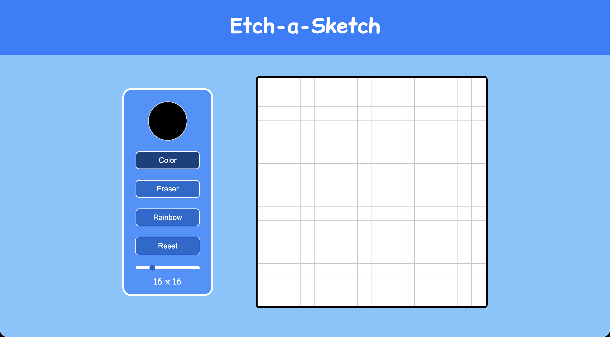

# etch-a-sketch

## About this Project

This is my second JavaScript project using the DOM, and it was quite a challenge. It was really fun to build it on my own, without much instruction this time.

This project is a task from The Odin Project, a structured full stack development course. You can learn at your own pace and it starts from 0 to getting employed. I highly recommend taking this course. More on [The Odin Project](https://www.theodinproject.com/)

## Live Demo

Visit the page online: [Etch-a-Sketch](https://axhis8.github.io/etch-a-sketch/)

## Features

- Drawing on a board by holding the mouse
- Eraser
- Color Picker
- Rainbow mode
- Custom grid sizing
- Grid toggling
- Board Color filling

## Built With

- HTML5
- CSS3
- JavaScript

## What I Learned

- HTML Input
- JavaScript event handling
- DOM manipulation
- Iteration

## Screenshot

